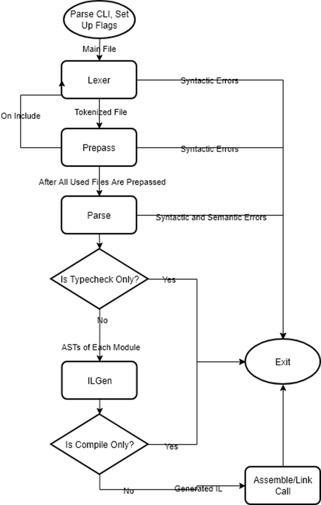
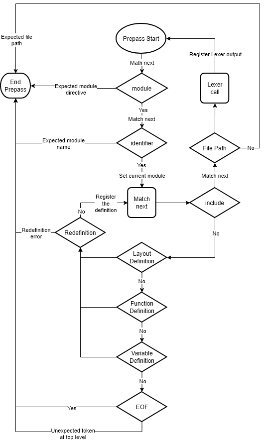

# JASL Compiler Documentation

> Note: This is not a language reference, if you wish to learn the JASL itself
> (eg. the syntax, behaviour, features), see the [language reference](./LANGUAGE_REFERENCE.md)

## Introduction

The JASL compiler is a simple, two-pass compiler that targets the [JASM IL](https://github.com/ysufender/JASM).
The compiler does (as for now) no optimizations to the given source file, and does not support incremental builds.

The JASL compiler is mainly written in the [Effekt research language](https://effekt-lang.org/), and depends on LLVM 15
as a backend. The compiler source includes C and C++ files as well, for JASM IL backend calls and various operations
such as file IO etc.

## Table of Contents

<table>
<tr><td width=33% valign=top>

* [Compilation Model](#compilation-model)
    * [Compilation Phase Chart](#compilation-phase-chart)
* [Compilation Phases](#compilation-phases)
    * [Entry Phase](#entry-phase)
    * [Lexical Analysis](#lexical-analysis)
    * [Parser Phase](#parser-phase)
        * [Prepass](#prepass)
        * [Parse](#parse)
            * [Scopes](#scopes)
            * [Type Checking](#type-checking)
            * [Limitations](#limitations)
            * [Notes and Closing](#notes-and-closing)
    * [IL Generation](#il-generation)

</td><td width=33% valign=top>

</td><td valign=top>

</td></tr>
<tr><td width=33% valign=top>

</td></tr>
</table>

## Compilation Model

JASL Compiler (will be addressed as JASLC from now on) is a single threaded, phase-based two-pass compiler with recursive source discovery during the first pass.
The compiler works recursively upon itself in the first pass, invoking the lexical analysis phase for every included file. We'll explain this in detail later.

There are mainly four phases, where one of them includes two sub-phases, resulting in a two-pass architecture. See the ["Compilation Phases"](#compilation-phases)
and the [compilation chart](#compilation-chart) below.

### Compilation Phase Chart



## Compilation Phases

There are four phases in compilation: Entry Phase, Lexical Analysis (or Lexer Phase), Parser Phase, and IL Generation. The Parser Phase consists of two
sub-phases: Prepass and Parse. This results in a two-pass compiler where Prepass sub-phase detects all used files, registers their lexer outputs to the compilation
context, and fills the global symbol table with function, layout, and global variable definitions.

### Entry Phase

The Entry Phase has two jobs: parsing the command line, setting up the compilation context. Below is the helper output from the current version of JASLC in debug build,
which lists all available command line flags and options:
 
```
The JASL Compiler
        Version: 0.1.0-debug
        Usage:
        jaslc <input_file> [flags]
                Flags:
                --help                  : print this help message

                --typecheck             : do not compile or assemble, typecheck only
                --compile               : do not assemble, generate IL only

                --static                : build a static library
                --dynamic               : build a dynamic library

                --release [jit = false] : build in release mode, with optional jit support. defaults to false.

                --output <file_name>    : set output file name
                --working <file_name>   : set working directory

                --check-nullptr         : enable nullptr check on every pointer operation

                --include <dir_path>    : include the given directory as a search path
```

After the parsing of the given command line structure, JASLC proceeds to detect the JASL stdlib path via the helper executable `jasl_install`, which
is expected to be on the PATH of your system. See the [README.md](../README.md#building-from-the-source) or the
[LANGUAGE_REFERENCE.md](./LANGUAGE_REFERENCE.md#building-from-the-source) for environment setting after a successful build.

On a successful execution of the `jasl_install` command, the compiler will append the JASL stdlib to the search path for inclusion.

> Note: Failure to locate the stdlib is an unrecoverable hard error, terminating the compilation right there before lexical analysis.

Lastly, the backend context (namely [AssemblyContext](https://github.com/ysufender/JASM)) will be created and that will be the end of the
entry phase.

### Lexical Analysis

After the Entry Phase, the input file given will be passed to the Lexer. The possible token types are as follows:

<table>
<tr><td width=33% valign=top>

* Literal
    * Bool
    * String
    * UInt
    * Int
    * Float
    * UByte
    * Byte
    * Pointer (recursive over said types)
    * Void (nullptr literal)
    * Custom

</td><td width=33% valign=top>

* Identifier

<td width=33% valign=top>

* Assembly
* EOF

</td></tr>
<tr><td width=33% valign=top>

* Keyword
    * Preprocessor
        * Module
        * Include
    * Wrapper
    * Layout
    * Fn
    * Pub
    * Return
    * Let
    * While
    * Extern
    * If
    * Else
    * Mut
    * Defer
    * Break
    * Continue

</td><td width=33% valign=top>

* Symbol
    * LParen
    * RParen
    * LBrace
    * RBrace
    * Comma
    * Colon
    * Semicolon
    * DotSym
    * DoubleColon
    * Arrow
    * Assign
    * Asterix
    * LessSym
    * GreatSym
    * LessEq
    * GreatEq
    * Equals
    * NotEq
    * NotSym
    * Minus
    * Plus
    * Divide
    * AndSym
    * OrSym

</td><td valign=top>

* TypeName
    * Bool
    * String
    * UInt
    * Int
    * Float
    * UByte
    * Byte
    * Pointer (recursive over said types)
    * Void
    * Custom

</td></tr>
</table>

> Note: The "extern" keyword is reserved, but the usage is not implemented yet.

The lexer is context free and does not perform semantic evaluation. All tokens are produced
greedily, and invalid sequences result in immediate lexer errors.

#### Lexer Level Desugaring

There are (for now) two specific sequences of characters that the lexer desugar directly.
Said sequences are: `.& (address operator)` and `.* (dereferencing operator)`.

The parser never sees these tokens as-is. They are converted into their identifier based
compiler builtins `.ref()` and `.deref()` respectively.

This conversion is purely based on the sequence of characters and not on any kind of semantic
context.

> Note: Keep in mind that the resulting tokens are `[dot][ref][lparen][rparen]`, and not a single
> token in such cases. This is possible due to the central lexer context created per tokenization call.
> The implementation details of the said system won't be explained in this reference due to possible
> rewrites of the compiler in different languages, hence due to the possibility of different implementations.

After the lexing of the file, the resulting token list is registered to the central compiler context
as a key-value pair (filename-tokens) and is accessible for reuse on request.

### Parser Phase

The first lexical analysis does not produce output that is directly passed to the parser. Instead the central
compiler context is used for storing global compilation data. This allows the two-phase parsing stage
to be independent of each other and any parameter. The necessary data will be requested from the compiler context.

#### Prepass

Prepass phase is the first phase of parsing stage, responsible for:

* Recursively detecting included files
* Performing lexical analysis and registering lexer outputs of each
file by doing callbacks to the lexer.
* Parsing and registering top-level signatures (layout definitions, function signatures, global variable signatures)
starting from the innermost (first inclusion of each file, recursively) file, hence allowing function hoisting.

The layout definitions exist only in prepass phase since they are just a zero-cost abstraction,
over blobs of memory. The second parser phase skips all layout definitions.

The prepass pipeline can be visualized like:



So with each include, a new Prepass fork will be created and the current fork will wait
until the child fork finishes. After this fork finishes, it will yield back to the parent fork.

Essentially, the task of the prepass is to set-up the environment for the second parser phase.

#### Parse

The second phase of the Parser, namely "Parse", operates under the assumption of a successful Prepass
phase. At this point a symbol lookup either succeeds, or fails deterministically. Since all top-level
symbols are registered successfully, function bodies can freely use symbols declared later in the
source files, or in the files that are guaranteed to be included within the project but are not directly
included in the current file.

In the current version of JASLC (0.1.0), forward declarations are not possible. They will be added as a part of the
version that implements the usage of `extern` keyword, which depends on the backend update on global data sections and
FFI support.

The Parse phase is responsible for detecting any semantic error, such as, but not limited to:

* Visibility violations
* Immutability violations
* Unknown types, unknown identifiers
* Namespace resolution on unknown module names
* Syntax errors

The only place where a semantic error occurs, except the Parse phase is ILGen phase, during the generation
of the compiler builtin `ref` function, in case the programmer is trying to get the address of a temporary value.
This occurence is due to the implementation of the builtin signatures into the compiler. They are treated no different
than a normal function during the parsing phase, so the specific condition checking for them happen after the Parse phase.

##### Scopes

There are three types of scopes available: global, function and block. Every scope is lexical (static), and they all
(except the global scope) derive their stack indices from their parent. A global scope can only have function scopes as children,
and a function scope can only have a block scope as children. In other words, nested functions or top-level blocks are not
allowed.

Every scope can be described as a record of: optional parent, stack index, variable map. The details of the implementation
will not be explained as per the aforementioned reasons.

##### Type Checking

> WARNING: The current typechecker is a hazily craeted one, due to certain deadlines. The nature of the
> typechecker will change drastically in the future.

Typechecking is done during and only during this phase. Currently mutability is not a part of the type system but rather
a part of the variable signature, but for future compatibility I'll act like it is a part of the type system here.

Type missmatches and conversions (both zero-cost and runtime) are checked here. Typechecker is not a separate
phase but an act that is done alongside the parsing. Due to this nature of the type resolving system, type inference 
is limited to inference from RHS in place, purely depending on the current context so far.

Keep in mind that implicit conversion does not exist in JASL, as stated in the [Language Reference](./LANGUAGE_REFERENCE.md).
For more information on conversions, see the language reference.

##### Limitations

Due to the simple style of it, the parser does not:

* Do optimizations
* Do lowering of any kind
* Generate warnings
* Detect unreachable paths

##### Notes and Closing

The Parser, just like the Lexer, does not return anything. Instead it requests the compiler context
and registers the generated ASTs per module.

Parser errors are fatal. Since incremental build support does not exist, in case of an error, the compiler
terminates before reaching the ILGen phase.

The Parse phase, as the end of the Parser phase, is the last phase to operate on source level structure. Beyond this
point everything is generated from compiler internal structures.

At the end, the Parser has:

* Validated the structural integrity of functions
* Validated the structural integrity of the statements
* Resolved the inferred types
* Validated the correct structure of stack on each operation
* And calculated the necessary stack offsets (be it local be it global)

The include order, hence the parsing order, of the files affect the generated AST ordering. This effect is
purely structural and guaranteed to be semantically equivalent.

#### IL Generation

Documentation is WIP
